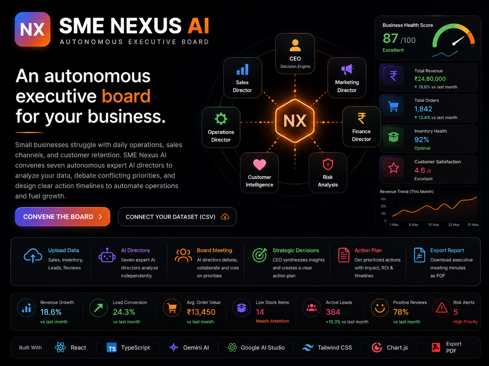

<p align="center">
  
</p>

<h1 align="center">SME Nexus AI</h1>

<p align="center">
Autonomous Executive Board for Small Businesses
</p>

#  SME Nexus AI

### Autonomous Multi-Agent Executive Board for Small & Medium Enterprises
## 🚀 Overview

**SME Nexus AI** is an autonomous multi-agent business intelligence platform designed for **Small and Medium Enterprises (SMEs)**.

Instead of providing a simple chatbot, SME Nexus AI simulates an **Executive Board Meeting**, where specialized AI executives independently analyze business data, collaborate on strategic decisions, and generate an executive action plan for business owners.

The platform transforms raw business data into clear, prioritized, and actionable business decisions.

---

# 🎯 Problem Statement

Small businesses often struggle with:

* Managing inventory efficiently
* Tracking sales performance
* Monitoring customer sentiment
* Managing sales leads
* Making strategic business decisions

Unlike large enterprises, SMEs cannot afford dedicated executives such as:

* CEO
* Sales Director
* Marketing Director
* Finance Director
* Operations Director
* Risk Manager

As a result, business owners spend valuable time manually analyzing spreadsheets instead of focusing on business growth.

---

# 💡 Our Solution

SME Nexus AI creates a **Virtual Executive Board** powered by multiple AI agents.

Each executive specializes in one business function.

Instead of a single AI response, every department independently evaluates business data before presenting recommendations to an AI CEO.

The CEO resolves conflicting recommendations and generates a prioritized strategic roadmap.

---

# 🤖 Executive AI Board

The platform consists of six specialized executive agents.

## 📈 Sales Director

Analyzes:

* Revenue trends
* Product performance
* Sales growth
* Order analytics

Provides:

* Revenue opportunities
* Sales insights
* Growth recommendations

---

## 📣 Marketing Director

Analyzes:

* Lead sources
* Marketing effectiveness
* Conversion opportunities

Provides:

* Lead generation strategy
* Marketing improvements
* Campaign recommendations

---

## ⚙ Operations Director

Analyzes:

* Inventory
* Stock availability
* Reorder levels

Provides:

* Operational improvements
* Inventory optimization
* Supply recommendations

---

## 💰 Finance Director

Analyzes:

* Revenue
* Business profitability
* Financial health

Provides:

* Budget optimization
* Cost reduction
* Financial planning

---

## ❤️ Customer Intelligence Director

Analyzes:

* Customer reviews
* Ratings
* Sentiment

Provides:

* Customer satisfaction insights
* Product feedback
* Service improvements

---

## 🛡 Risk Analysis Director

Analyzes:

* Operational risks
* Low stock
* Revenue fluctuations
* Customer complaints

Provides:

* Risk alerts
* Preventive recommendations
* Business safeguards

---

## 👨‍💼 AI CEO

The CEO receives recommendations from every executive.

The CEO then:

* Resolves conflicting opinions
* Prioritizes actions
* Calculates business impact
* Generates the Executive Action Plan

---

# 🔄 Workflow

```text
Business Data Upload

        │

        ▼

Sales CSV
Inventory CSV
Leads CSV
Reviews CSV

        │

        ▼

Business Intelligence Engine

        │

        ▼

Executive Board Meeting

        │

        ▼

Sales Director
Marketing Director
Operations Director
Finance Director
Customer Intelligence
Risk Analysis

        │

        ▼

CEO Decision Engine

        │

        ▼

Executive Board Voting

        │

        ▼

Strategic Action Plan

        │

        ▼

Business Health Dashboard

        │

        ▼

What-If Simulation

        │

        ▼

PDF Executive Report
```

---

# ✨ Key Features

* Multi-Agent AI Architecture
* Executive Board Simulation
* CEO Decision Intelligence
* Executive Board Voting
* Business Health Dashboard
* Sales Analytics
* Inventory Intelligence
* Customer Sentiment Analysis
* Lead Management Analysis
* Strategic Business Recommendations
* What-If Business Simulator
* PDF Meeting Minutes Export
* Interactive Analytics Dashboard
* Modern Enterprise User Interface

---

# 📊 Input Data

The platform accepts four business datasets.

### 📈 Sales

* Orders
* Revenue
* Products
* Channels

---

### 📦 Inventory

* Stock Levels
* Reorder Thresholds
* Product Cost
* Inventory Status

---

### 🎯 Leads

* Pipeline Stage
* Lead Source
* Conversion Probability
* Deal Value

---

### ⭐ Customer Reviews

* Ratings
* Sentiment
* Product Reviews
* Customer Feedback

---

# 📈 Dashboard

The dashboard provides:

* Business Health Score
* Total Revenue
* Total Orders
* Inventory Health
* Customer Satisfaction
* Sales Trends
* Revenue Analytics
* Executive KPIs

---

# 🧠 AI Decision Process

Unlike traditional dashboards, SME Nexus AI allows every executive to independently analyze business information before collaborating.

The CEO combines all recommendations and generates:

* Prioritized Actions
* Expected ROI
* Business Impact
* Risk Assessment
* Executive Summary

---

# 🔮 What-If Business Simulator

Business owners can simulate different scenarios such as:

* Revenue decrease
* Marketing budget increase
* Inventory shortage
* Demand spikes

The Executive Board recalculates recommendations in real time, enabling proactive decision-making.

---

# 🛠 Technology Stack

### Frontend

* React
* TypeScript
* Tailwind CSS

### AI

* Google Gemini
* Google AI Studio

### Visualization

* Interactive Dashboards
* Business Analytics
* KPI Widgets

### Export

* PDF Reports

---

# 📁 Project Structure

```text
SME-Nexus-AI

├── src
├── components
├── pages
├── services
├── hooks
├── utils
├── assets
├── public
├── package.json
├── README.md
```

---

# 🚀 Installation

```bash
git clone https://github.com/bala-coder-dev/SME-Nexus-AI.git

cd SME-Nexus-AI

npm install

npm run dev
```

---

# 🎥 Demo

A complete demonstration video showcasing:

* Project Overview
* Live AI Executive Board
* Analytics Dashboard
* Executive Decision Process
* What-If Simulator
* Business Impact

---

# 🌍 Real-World Applications

SME Nexus AI can assist:

* Electrical Wholesalers
* Retail Businesses
* Manufacturing SMEs
* Distribution Companies
* Trading Businesses
* Service Companies

---

# 📌 Future Scope

* ERP Integration
* CRM Integration
* Email Automation
* WhatsApp Business Integration
* Predictive Forecasting
* Cloud Deployment
* Multi-language Support
* Voice-Based Executive Meetings

---

# 👨‍💻 Developed For

**Agentic Arena 2026**

**Business & Productivity Theme**

**Case Study: SME Growth Assistant**

---

# 📄 License

This project is licensed under the MIT License.

---


### ⭐ If you found this project interesting, consider giving it a Star!

**Transforming Business Data into Executive Decisions**


